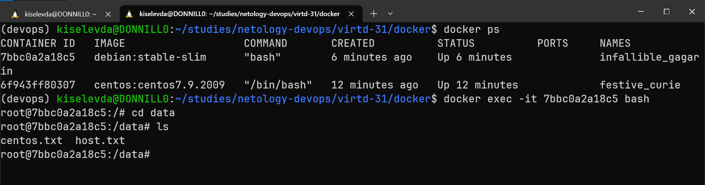

# Домашнее задание к занятию 3. «Введение. Экосистема. Архитектура. Жизненный цикл Docker-контейнера»

## Задача 1

Сценарий выполнения задачи:

- создайте свой репозиторий на https://hub.docker.com;
- выберите любой образ, который содержит веб-сервер Nginx;
- создайте свой fork образа;
- реализуйте функциональность:
  запуск веб-сервера в фоне с индекс-страницей, содержащей HTML-код ниже:

```
<html>
<head>
Hey, Netology
</head>
<body>
<h1>I’m DevOps Engineer!</h1>
</body>
</html>
```

Опубликуйте созданный fork в своём репозитории и предоставьте ответ в виде ссылки на https://hub.docker.com/username_repo.

### Решение

> Для выполнения задачи был выбран образ [nginx:1.25.1-alpine-slim](https://hub.docker.com/layers/library/nginx/1.25.1-alpine-slim/images/sha256-3b29f9ec76a085552a6ad469b84711642b2421c7c44d2b765ca8d9e8fb25c4e8?context=explore) и создан Dockerfile следующего содержания:
>
> 
>
> Следующие команды были выполнены, чтобы собрать и опубликовать образ:
>
> `bash docker build . -t donnillo/nginx-netology-devops`
>
> `bash docker push donnillo/nginx-netology-devops`
>
> Итоговый образ доступен по [ссылке на DockerHub](https://hub.docker.com/r/donnillo/nginx-netology-devops)

## Задача 2

Посмотрите на сценарий ниже и ответьте на вопрос:
«Подходит ли в этом сценарии использование Docker-контейнеров или лучше подойдёт виртуальная машина, физическая машина? Может быть, возможны разные варианты?»

Детально опишите и обоснуйте свой выбор.

Сценарий:

- высоконагруженное монолитное Java веб-приложение;
  > Слова "монолит" и docker по идее не должны употребляться вместе) Слово "высоконагруженный" тоже как бы намекает на особые требования к физическим и сетевым ресурсам. Вероятно, здесь лучше обойтись без контейнеризации
- Nodejs веб-приложение;
  > А вот тут, напротив, классический пример лёгкого использования docker. Один из самых популярных образов у JS-разработчиков
- мобильное приложение c версиями для Android и iOS;
  > Насколько мне известно, в мобильной разработке особенно важны стабильность окружения и изоляция зависимостей. Docker, успешно решающий эти задачи в вэб-разработке, может быть полезен и здесь, да
- шина данных на базе Apache Kafka;
  > Apache Kafka – система с довольно сложной архитектурой из нескольких коспонентов/сервисов, каждый из которых может быть контейнеризирован для стабильной и изолированной работы в общей сети кластера. Да, здесь docker может упростить жизнь
- Elasticsearch-кластер для реализации логирования продуктивного веб-приложения — три ноды elasticsearch, два logstash и две ноды kibana;
  > Тут то же, что и выше. Насколько мне известно, каждый из компонентов ELK-стека вполне успешно может быть запущен в контейнере, что также существенно облегчает жизнь при разворачивании кластера логирования
- мониторинг-стек на базе Prometheus и Grafana;
  > Об этих продукта пока мало что знаю, но, вероятно, популярные docker-решения есть и для них
- MongoDB как основное хранилище данных для Java-приложения;
  > Немного смущает слово "основное". Mongo вроде бы чаще используют для легковесных приложений, для которых оптимальна документо-ориентированная система хранения и передачи данных. Если нужна стабильная репликация, то, вероятно, одного mongo-контейнера будет мало. Впрочем, если надёжно настроены тома, то почему бы и нет
- Gitlab-сервер для реализации CI/CD-процессов и приватный (закрытый) Docker Registry.
  > Тут не знаю. Возможно, для таких больших и важных дел лучше использовать физические сервера

## Задача 3

- Запустите первый контейнер из образа **_centos_** c любым тегом в фоновом режиме, подключив папку `/data` из текущей рабочей директории на хостовой машине в `/data` контейнера.
  > Качаем и запускаем образ в фоновом (**d**etached) с запуском интерактивного терминала (**i**nteractive **t**erminal), чтобы в контейнере был живой процесс, попутно создав рабочую папку и правильно примонтировав тома
  >
  > 
- Запустите второй контейнер из образа **_debian_** в фоновом режиме, подключив папку `/data` из текущей рабочей директории на хостовой машине в `/data` контейнера.
  > То же самое проделываем с debian-образом
  >
  > 
- Подключитесь к первому контейнеру с помощью `docker exec` и создайте текстовый файл любого содержания в `/data`.
  > Убеждаемся, что оба контейнера запущены, копируем ID первого, подключаемся к нему, вызвав bash-оболочку с помощью `docker exec`, создаём файл внутри контейнера и выходим из него
  >
  > 
- Добавьте ещё один файл в папку `/data` на хостовой машине.
  > Создаем файл на хостовой машине и убеждаемся, что оба файла в наличии в примонтированной папке
  >
  > 
- Подключитесь во второй контейнер и отобразите листинг и содержание файлов в `/data` контейнера.
  > Подключаемся аналогично к debian-контейнеру и убеждаемся. что оба файла доступны и там. Отлично. Значит, мы правильно смонтировали тома
  >
  > 
