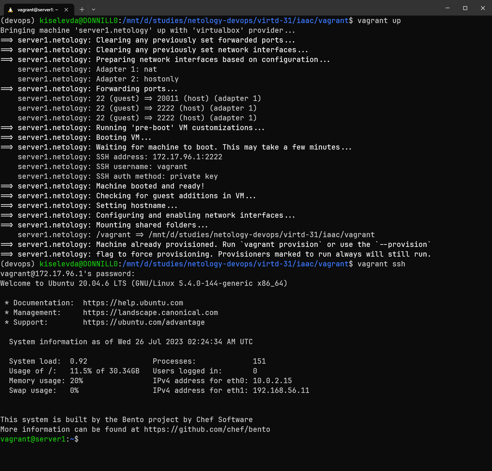
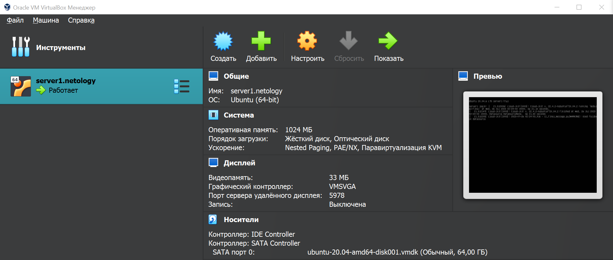

# Домашнее задание к занятию 2. «Применение принципов IaaC в работе с виртуальными машинами»

## Задача 1

- Опишите основные преимущества применения на практике IaaC-паттернов.

> IaaC-подход, как следует из его названия, позволяет работать с инфраструктурой разработки так же как с ПО, а значит, использовать такие доказавшие свою эффективность практики, как системы контроля версий и принципы CI/CD (раннее выявление ошибок, возможность переключения между различными вариантами конфигураций, отката версий, автоматизированный deploy и т.д.). IaaC позволяет минимизировать риски ошибок, связанных с ручной настройкой конфигураций, облегчает использование шаблонов и типизированных вариантов инфраструктурных решений, а также их масштабирование.

- Какой из принципов IaaC является основополагающим?

> Основным принципом IaaC, полагаю, следует считать приминение декларативного подхода: надо лишь указать требуемое состояние узлов инфраструктуры.

## Задача 2

- Чем Ansible выгодно отличается от других систем управление конфигурациями?

> Ansible использует протокол SSH, а также популярный и нативный для Linux-систем скриптовый язык python, что позволяет обходится без специального агентского ПО на целевых хостах, и, кроме того, облегчает освоение этого инструмента.

- Какой, на ваш взгляд, метод работы систем конфигурации более надёжный — push или pull?

> Push-подход (основной для Ansible), как я понимаю, более популярен и неслучайно. Он обеспечивает наиболее централизованное управление артефактами и компонентами ПО, которые необходимо доставить на целевые ВМ. Управляющий сервер отвечает за всё, использование агентов на целевых хостах не требуется. Надёжнее, потому что проще.

## Задача 3

Установите на личный компьютер:

- [VirtualBox](https://www.virtualbox.org/),
- [Vagrant](https://github.com/netology-code/devops-materials),
- [Terraform](https://github.com/netology-code/devops-materials/blob/master/README.md),
- Ansible

> Тут пришлось помучаться, т. к. работаю из-под WSL. Поэтому VirtualBox установлен на Windows, а всё остальное в WSL.

## Задача 4

Воспроизведите практическую часть лекции самостоятельно.

> Тут особенно пришлось поплясать, чтобы заставить Vagrant правильно работать из-под WSL. Просто установить его оказалось мало.
> Помогли эти ссылки:
>
> - [Vagrant and Windows Subsystem for Linux](https://developer.hashicorp.com/vagrant/docs/other/wsl)
> - [How to run Vagrant + VirtualBox on WSL2](https://blog.thenets.org/how-to-run-vagrant-on-wsl-2/)
> - [vagrant up – Running Vagrant under WSL2](https://thedatabaseme.de/2022/02/20/vagrant-up-running-vagrant-under-wsl2/)
>
> В частности, потребовалось установить специальный плагин следующей командой (без дополнительных флажков нужный ruby-компонент не скачается):
>
> `vagrant plugin install virtualbox_WSL2 --plugin-clean-sources --plugin-source https://rubygems.org`
>
> Также пришлось поправить Vagrantfile. Во-первых, отключил опцию SharedFoldersEnableSymlinksCreate (иначе были раздражающие предупреждения о безопасности), во-вторых, указал compatibility_mode = "2.0" для Ansible (без этого Vagrant почему-то неправильно определял версию Ansible, что приводило к ошибкам уже самой Ansible).
> Ещё потребовалось прописать несколько переменных среды для Vagrant (см. ссылки выше) и Ansible (последняя, в частности, ругалась на неправильное расположение конфигурационного файла).
> И финальный штрих. Оказалось, что в правилах для входящих подключениях брендмауэра Windows нужно разрешить частное и общее подключение к VirtualBox Headless Frontend. Иначе Windows тупо блокировала SSH подключение к уже поднятой ВМ, что приводило к timeout-ошибке.

> В итоге всё (тоже не с первого раза) заработало! Ура! Ещё одна бессонная ночь.
