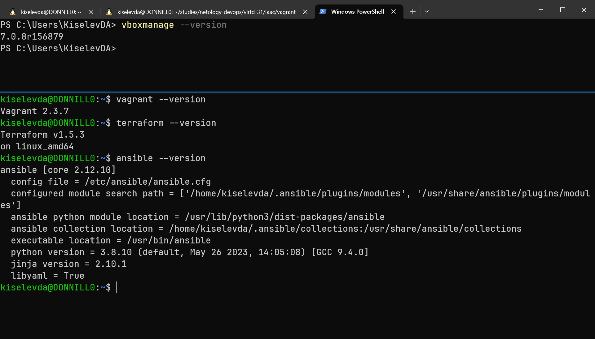

# Домашнее задание к занятию 2. «Применение принципов IaaC в работе с виртуальными машинами»

## Задача 1

- Опишите основные преимущества применения на практике IaaC-паттернов.

> IaaC-подход, как следует из его названия, позволяет работать с инфраструктурой разработки так же как с ПО, а значит, использовать такие доказавшие свою эффективность практики, как системы контроля версий и принципы CI/CD (раннее выявление ошибок, возможность переключения между различными вариантами конфигураций, отката версий, автоматизированный deploy и т.д.). IaaC позволяет минимизировать риски ошибок, связанных с ручной настройкой конфигураций, облегчает использование шаблонов и типизированных вариантов инфраструктурных решений, а также их масштабирование.

- Какой из принципов IaaC является основополагающим?

> Основным принципом IaaC, полагаю, следует считать приминение декларативного подхода: надо лишь указать требуемое состояние узлов инфраструктуры.

## Задача 2

- Чем Ansible выгодно отличается от других систем управление конфигурациями?

> Ansible использует протокол SSH, а также широко используемый и нативный для Linux-систем язык python, что позволяет уйти от необходимости использовать специальное агентское ПО на целевых хостах, и, кроме того, облегчает освоение этого инструмента.

- Какой, на ваш взгляд, метод работы систем конфигурации более надёжный — push или pull?

> Push-подход (основной для Ansible), как я понимаю, более популярен и неслучайно. Он обеспечивает наиболее централизованное управление артефактами и компонентами ПО, которые необходимо доставить на целевые ВМ. Управляющий сервер отвечает за всё, использование агентов на целевых хостах не требуется. Надёжнее, потому что проще.

## Задача 3

Установите на личный компьютер:

- [VirtualBox](https://www.virtualbox.org/),
- [Vagrant](https://github.com/netology-code/devops-materials),
- [Terraform](https://github.com/netology-code/devops-materials/blob/master/README.md),
- Ansible

> Тут пришлось помучаться, т. к. работаю из-под WSL. Поэтому VirtualBox установлен на Windows, а всё остальное в WSL.

